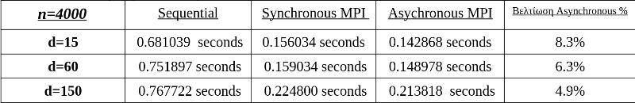

# MPI distributed search algorithm for the 𝑘 nearest neighbors (𝑘-NN) problem
_Excercise for the Parallel & Distributed Computer Systems course, school of Electrical and Computer Enginneering, AUTH_  
_November of 2019_

## Project description
MPI implementation of an all-to-all-point distance matrix calculation and k nearest neighbor finding algorithm. Use of BLAS routines for fast matrix calculations. For this implementation, 3 different versions are constructed and compared to each other:
* **V0: Sequential version:** A basic MPI-free version useful for testing against the performance of the MPI versions.
* **V1: Synchronous version:** Each process receives and holds an equal part of the initial set of points. Copies of these parts are exchanged with other processes in a ring topology.
* **V2: Asynchronous version:** The communication costs are hidden by using asynchronous data transfer and performing computations in the meantime.

## Results
The following table gives measured execution times for the 3 different versions and variable problem sizes. The [full report](Υλοποίηση%20ενός%20αλγορίθμου%20για%20K-NN%20Search%20με%20χρήση%20MPI.pdf) is available in greek. Times are measured in seconds. 

